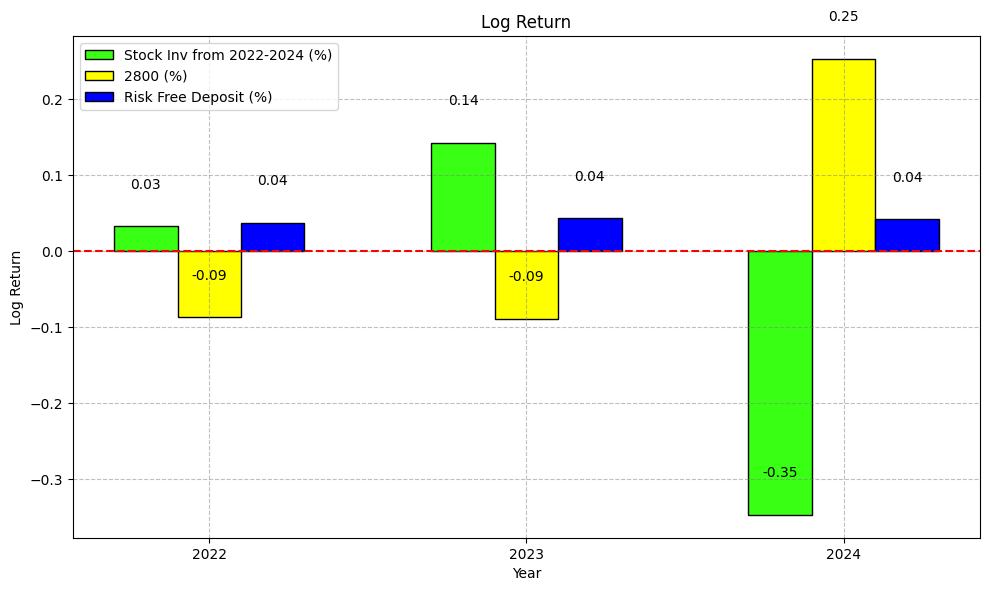

<HEAD
CT298DS005 Strategic-Decision-Report-Hong-Kong-Fund-Evaluation
26/5/2025

CT298DS005 Python Project:

Strategic Decision Report on Outcomes Related to Economic Challenges in
Hong Kong

(2021-2024) and the Potential Dissolution of the Fund in 2025

***Team*** ***Member:*** ***6*** 甘慶腾

> ***10*** 林時鴻***Lambo***
>
> ***16*** 陶潤桐***To*** ***Yun*** ***Tung***
> 
> ***23*** ***莊漢波***Chong*** ***Hon*** ***Por***
>
> ***20*** 馬文明***Franco*** ***Ma***
>
> Page 1

CT298DS005 Strategic-Decision-Report-Hong-Kong-Fund-Evaluation 26/5/2025

> Table of Contents

1\. Company
Background...........................................................................................................
3 2. Detail
Analysis.......................................................................................................................
7 3. Strategic
Shift......................................................................................................................
10 4.Additional
Analysis...............................................................................................................14
5.
Conclusion...........................................................................................................................17
6.
Appendix.............................................................................................................................
18

> Page 2

CT298DS005 Strategic-Decision-Report-Hong-Kong-Fund-Evaluation
26/5/2025

1\. Company Background

We are a global investment management corporation headquartered in New
York City. Established in 1988, we have evolved into one of the largest
asset managers in the world, offering a comprehensive range of
investment and technology services to our clients.

Hong Kong serves as a crucial area for our operations, functioning as a
significant financial center where we have consistently expanded our
presence and generated substantial income. Our Hong Kong fund house has
been a notable player in the investment landscape for decades, focusing
exclusively on the Hong Kong (HK) stock market. Historically, our
portfolio has delivered exceptional results, capitalizing on the
impressive growth trajectory of the Hang Seng Index (HSI). Over the past
20 years, the HK economy has shown robust performance, aligning closely
with other leading global economies such as the USA and Japan.

Our investment strategy has enabled us to achieve remarkable returns
with minimal reliance on fundamental analysis. We primarily focus on
top-tier blue-chip stocks, which secure attractive returns for our
investors while generating substantial management income.

> ● Diagram 1: Time Series Analysis - Historical Performance of Major
> Global Markets (Nasdaq, S&P, Nikkei)
>
> Page 3

CT298DS005 Strategic-Decision-Report-Hong-Kong-Fund-Evaluation
26/5/2025

> ● Diagram 2: Logarithmic Income Comparison - Global Major Stock
> Markets (Nasdaq, S&P, Nikkei)
>
> ● Diagram 3: Moving Average of Global Major Stock Markets (Nasdaq,
> S&P, Nikkei) from 2005 to 2024
>
> Page 4

CT298DS005 Strategic-Decision-Report-Hong-Kong-Fund-Evaluation
26/5/2025

> ● Diagram 4: Logarithmic Income and Simple Income Comparison - Global
> Major Stock Markets (Nasdaq, S&P, Nikkei) from 2004 to 2024

**<u>Current Situation</u>**

Despite our historical success, the HK stock market has faced challenges
since 2019, as evidenced by the performance of the HSI in comparison to
the Nasdaq, S&P, and Nikkei (Diagram 1). The COVID-19 pandemic has
exacerbated this decline, leading to a significant loss of
competitiveness against other markets (Diagrams 1 and 2). As a result,
we have experienced portfolio losses and a decline in investor
confidence. Given the shrinking Managed Underlying Assets (MUA), we find
ourselves at a critical juncture: we must decide whether to continue
with the HK fund or to pivot toward more promising markets.

**<u>Mission of the Project</u>**

**<u>1. Performance Projection</u>**

Recognizing the cyclical nature of markets, it is imperative that we
navigate downturns effectively. Our first mission is to project the
future performance of the HK market for 2025 using advanced regression
analysis or ARIMA, based on a robust dataset encompassing the

> Page 5

CT298DS005 Strategic-Decision-Report-Hong-Kong-Fund-Evaluation
26/5/2025

last 10 years (2014-2024). If the forecast indicates a favorable
outlook, we will consider maintaining our investment strategy into the
subsequent year (Diagram 5: Regression Analysis - Projection of Future
Performance in 2025).

> ● Diagram 5: Regression Analysis - Projection of Future Performance in
> 2025
>
> ● Diagram 6: Regression Analysis - Projection of Future Performance in
> 2025 (Table)
>
> Page 6

CT298DS005 Strategic-Decision-Report-Hong-Kong-Fund-Evaluation 26/5/2025

2\. Detail Analysis

We will select three stocks with the highest scores each year from 2021
to 2024 based on our own stock selection model, and then evaluate them
based on the total returns over the past four years. Growth, Market cap,
ROA, and PE are used as scoring criteria.

The first step involved retrieving a list of all securities traded on
the HKEX. This dataset provided the foundation for identifying eligible
equities for further analysis. Next, to ensure relevance and accuracy,
non-equity instruments such as ETFs, bonds, and preferred shares were
filtered out. The result was a clean list of Mainboard HK stock tickers
for further processing. With the ticker list we can now proceed to
download the Historical and current financial data for each ticker
collected from Yahoo Finance over a four-year period. The following data
points were gathered:

> **●** **Company** **Information:** Name, Sector
>
> **●** **Market** **Data:** Market Capitalisation, Stock Closing Price
> **●** **Financials:** Revenue, Dividends, EBITDA, Total Assets

Using the collected data, key financial metrics were calculated to
evaluate company performance and valuation:

> ● **Return** **on** **Assets** **(ROA):** EBITDA **÷** Total Assets
> **×** 100%
>
> ● **Earnings** **Per** **Share** **(EPS):** Net Income **÷** Shares,
> if EPS is not in the financial report. ● **Price-to-Earnings**
> **(P/E)** **Ratio:** Last Close **÷** EPS
>
> **●** **Difference:** (Last Close - First Close) + Dividends
>
> ● **Growth:** Difference **÷** First Close **×** 100%

All the collected and calculated data was compiled into a structured CSV
file. This format makes it easy to share, import into other tools, and
integrate with scoring or ranking models for later uses. Finally, we
narrowed our focus to the top 50 stocks ranked by market capitalization.
These are typically more stable companies, making them ideal candidates
for deeper scoring and comparative analysis.

*Data* *Result* *Set:*

> Page 7

CT298DS005 Strategic-Decision-Report-Hong-Kong-Fund-Evaluation
26/5/2025

In summary, we’ve established an adequate pipeline, from data
acquisition to metric calculation that allows us to evaluate and rank
stocks systematically. With this foundation in place, we’re now ready to
move on to the scoring and selection phase.

**<u>Scoring:</u>**

We extract several indicators from the basic data in the database with
certain weight：

Growth_weight = 0.5

Cap_weight = 0.2

ROA_weight = 0.2

PE_weight = 0.1

> Page 8

CT298DS005 Strategic-Decision-Report-Hong-Kong-Fund-Evaluation
26/5/2025

Growth Score = \[‘Growth(%)’\]\*Growth_weight

Market Cap Score = \['Market Cap (B HKD)'\]/100)\*Cap_weight

ROA Scoring = \['ROA (%)'\]\*ROA_weight

\['PE Scoring'\] = IF PE_Ratio \> PE upper range or IF PE_Ratio \< PE
upper range, pe scoring = -2

**ROA** and **Market** **Cap** are directly obtained from the original
data, while **PE** **ratio** and **Growth** require a little
explanation:

> 1\. Growth(%) = (Close price of last day of year - Close price of 1st
> day of year + dividend) / Close price of 1st day of year
>
> 2\. **<u>P.E. formula:</u>**
>
> a\. PE upper range = PE_Mean\*0.2 + PE_Mean
>
> b\. PE lower range = PE_Mean - PE_Mean\*0.2

*Diagram* *6A* : PE Score by Sector

> Page 9

CT298DS005 Strategic-Decision-Report-Hong-Kong-Fund-Evaluation
26/5/2025

3\. Strategic Shift

In light of the positive results from the projection analysis, we are
implementing a shift in our investment strategy from a blue-chip focus
to a growth-driven selection model. This new approach will involve
identifying the fastest-growing stocks at year-end since 2021, utilizing
a shape model with equal portfolio allocation. Our selection criteria
will encompass various factors, including net worth, total income (which
includes share price growth and dividends), P/E ratio, and years of
establishment, among others.

Based on the established formula and criteria for stock selection from
2021 to 2024, we aim to identify the top three stocks for investment in
the upcoming year. This approach allows for the possibility of selecting
new stocks each year, as well as the emergence of new combinations of
rising stocks, including entirely new names in subsequent years. Below
are the stocks identified for 2021 through 2024.

> ● Diagram 7: Heatmap Analysis - Performance Ranking and Selection
> Methodology 2021
>
> Page 10

CT298DS005 Strategic-Decision-Report-Hong-Kong-Fund-Evaluation
26/5/2025

> ● Diagram 8: Heatmap Analysis - Performance Ranking and Selection
> Methodology 2022
>
> Page 11

CT298DS005 Strategic-Decision-Report-Hong-Kong-Fund-Evaluation
26/5/2025

> ● Diagram 9: Heatmap Analysis - Performance Ranking and Selection
> Methodology 2023
>
> ● Diagram 10: Heatmap Analysis - Performance Ranking and Selection
> Methodology 2024
>
> Page 12

CT298DS005 Strategic-Decision-Report-Hong-Kong-Fund-Evaluation
26/5/2025

The performance of the selected portfolio for the years 2021, 2022, and
2023 will be calculated and compared with the Tracker Fund of Hong Kong
(2800) and the 10-Year U.S. Government Bond at the end of each
respective year. The returns for each portfolio will be documented as
follows:

> ● Diagram 11: Statistics of the Stocks Selected from 2021 to 2024,
> together with Tracker Fund, HK (2800) and the 10-Year U.S. Government
> Bond Rate (Table)

The logarithmic return of the aforementioned performance will be
calculated, as illustrated in the following diagram.

> ● Diagram 12: Log Return of the Stocks Selected from 2021 to 2024,
> along with the Tracker Fund, HK (2800) and the 10-Year U.S. Government
> Bond Rate.
>
>  style="width:5.35417in;height:3.73958in" />Page 13

CT298DS005 Strategic-Decision-Report-Hong-Kong-Fund-Evaluation 26/5/2025

> Page 14

CT298DS005 Strategic-Decision-Report-Hong-Kong-Fund-Evaluation
26/5/2025

4.Additional Analysis

Following the log return analysis, we will examine the correlation
between stock growth (y-axis) and several key financial indicators,
including ROA, Market Cap, Revenue, EPS, Close Difference, and P/E
Ratio. Preliminary results indicate weak correlations, with most
coefficients ranging from 0.03 to 0.5, and some suggesting negative
relationships (-0.05). This raises important questions about our
previous assumptions regarding the factors driving stock performance.
The fluctuations in the HK stock market appear to be influenced by
unknown variables that extend beyond our initial analysis.

Given these findings, we conclude that it is prudent to dissolve the
fund and return the capital to investors. The performance of the HK
stock market has not met expectations, and it has consistently
underperformed compared to the Tracker Fund (2800). Our analysis reveals
no significant correlation between key predictive factors and the
performance of HK stocks in recent years. Consequently, we recommend
dissolving the fund and returning the investments to our clients. This
decision will be submitted for board approval.

> ● **Diagram** **13**: Correlation Heatmap - Factors Influencing Growth
> from 2021
>
> Page 15

CT298DS005 Strategic-Decision-Report-Hong-Kong-Fund-Evaluation
26/5/2025

> ● **Diagram** **14**: Correlation Heatmap - Factors Influencing Growth
> from 2022
>
> ● **Diagram** **15**: Correlation Heatmap - Factors Influencing Growth
> from 2023
>
> Page 16

CT298DS005 Strategic-Decision-Report-Hong-Kong-Fund-Evaluation
26/5/2025

> ● **Diagram** **16**: Correlation Heatmap - Factors Influencing Growth
> from 2024
>
> Diagram 17: Growth Correlation Across Years
>
> Page 17

CT298DS005 Strategic-Decision-Report-Hong-Kong-Fund-Evaluation 26/5/2025

5\. Conclusion

In light of our comprehensive analysis, we present the following
findings and recommendations for board approval:

> 1\. Underperformance of HK Stocks: Our selected HK stocks have
> consistently underperformed, yielding results inferior to those of the
> Tracker Fund (2800). This trend raises concerns regarding the
> viability of our current investment strategy.
>
> 2\. Uncertainty in Growth: The growth exhibited by HK stocks in any
> given year does not guarantee continued success in subsequent years.
> This indicates that our growth-focused stock selection strategy has
> not delivered the expected outcomes, despite its cost-effectiveness
> and operational efficiency.
>
> 3\. Weak Correlations with Traditional Metrics: Our correlation
> analysis demonstrates that traditional financial indicators, such as
> Return on Assets (ROA) and Market Capitalization, show little to no
> relationship with the growth of HK stocks. This suggests that the
> factors driving stock performance remain elusive, necessitating a
> reevaluation of our investment approach.
>
> 4\. Recommendation for Fund Termination: Given our findings, it is
> prudent to terminate the HK fund. Continuing to hold cash while
> awaiting a more favorable market environment is not a sustainable
> strategy for our investors.
>
> 5\. Proposal for Board Approval: We recommend presenting this
> conclusion to the board for approval, advocating for the dissolution
> of the fund and the return of capital to our investors. This decision
> reflects our commitment to safeguarding investor interests and
> maintaining transparency in our operations.
>
> Page 18

CT298DS005 Strategic-Decision-Report-Hong-Kong-Fund-Evaluation 26/5/2025

6\. Appendix

> ● *Diagram* *1*: *Time* *Series* *Analysis* *-* *Historical*
> *Performance* *of* *Major* *Global* *Markets* *(Nasdaq,* *S&P,*
> *Nikkei)*
>
> ● *Diagram* *2*: *Logarithmic* *Income* *Comparison* *-* *Global*
> *Major* *Stock* *Markets* *(Nasdaq,* *S&P,* *Nikkei)*
>
> ● *Diagram* *3* : *3-Period* *Moving* *Average* *of* *Major* *Stock*
> *Markets* *(Nasdaq,* *S&P,* *Nikkei)* ● *Diagram* *4* : *Log* *Return*
> *of* *Major* *Stock* *Markets* *(Nasdaq,* *S&P,* *Nikkei)*
>
> ● *Diagram* *5*: *Regression* *Analysis* *or* *ARIMA* *-* *Projection*
> *of* *Future* *Performance* *in* *2025* ● *Diagram* *6*: HSI Forecast
> Summary (2025)
>
> ● *Diagram* *6A* : PE Score by Sector
>
> ● *Diagram* *7*: *Shape* *Model* *Analysis* *-* *Performance*
> *Ranking* *and* *Selection* *Methodology* *2021*
>
> ● *Diagram* *8*: *Shape* *Model* *Analysis* *-* *Performance*
> *Ranking* *and* *Selection* *Methodology* *2022*
>
> ● *Diagram* *9*: *Shape* *Model* *Analysis* *-* *Performance*
> *Ranking* *and* *Selection* *Methodology* *2023*
>
> ● *Diagram* *10*: *Shape* *Model* *Analysis* *-* *Performance*
> *Ranking* *and* *Selection* *Methodology* *2024*
>
> ● Diagram 11: Statistics of the Stocks Selected from 2021 to 2024,
> together with Tracker Fund, HK (2800) and the 10-Year U.S. Government
> Bond Rate
>
> ● Diagram 12: Log Return of the Stocks Selected from 2021 to 2024,
> along with the Tracker Fund, HK (2800) and the 10-Year U.S. Government
> Bond Rate.
>
> ● *Diagram* *13*: *Correlation* *Heatmap* *-* *2021* ● *Diagram* *14*:
> *Correlation* *Heatmap* *-* *2022* ● *Diagram* *15*: *Correlation*
> *Heatmap* *-* *2023* ● *Diagram* *16*: *Correlation* *Heatmap* *-*
> *2024*
>
> ● *Diagram* *17*: Growth *Correlation* *Across* *Years*

\*\*\* End of Report \*\*\*

> Page 19
=======
 CT298DS005 Strategic-Decision-Report-Hong-Kong-Fund-Evaluation
26/5/2025
 CT298DS005 Python Project:
Team Member:
6 甘慶腾
10 林時鴻 Lambo
16 陶潤桐 To Yun Tung 23 莊漢波 Chong Hon Por
20 馬文明 Franco Ma
Page 1
5202 ni dnuF eht fo noitulossiD laitnetoP eht dna )4202-1202( gnoK gnoH ni segnellahC cimonocE ot detaleR semoctuO no tropeR noisiceD cigetartS

 CT298DS005 Strategic-Decision-Report-Hong-Kong-Fund-Evaluation 26/5/2025
Table of Contents
1. Company Background........................................................................................................... 3 2. Detail Analysis....................................................................................................................... 7 3. Strategic Shift...................................................................................................................... 10 4.Additional Analysis...............................................................................................................14 5. Conclusion...........................................................................................................................17 6. Appendix............................................................................................................................. 18
Page 2

 CT298DS005 Strategic-Decision-Report-Hong-Kong-Fund-Evaluation 26/5/2025
1. Company Background
We are a global investment management corporation headquartered in New York City. Established in 1988, we have evolved into one of the largest asset managers in the world, offering a comprehensive range of investment and technology services to our clients.
Hong Kong serves as a crucial area for our operations, functioning as a significant financial center where we have consistently expanded our presence and generated substantial income. Our Hong Kong fund house has been a notable player in the investment landscape for decades, focusing exclusively on the Hong Kong (HK) stock market. Historically, our portfolio has delivered exceptional results, capitalizing on the impressive growth trajectory of the Hang Seng Index (HSI). Over the past 20 years, the HK economy has shown robust performance, aligning closely with other leading global economies such as the USA and Japan.
Our investment strategy has enabled us to achieve remarkable returns with minimal reliance on fundamental analysis. We primarily focus on top-tier blue-chip stocks, which secure attractive returns for our investors while generating substantial management income.
● Diagram 1: Time Series Analysis - Historical Performance of Major Global Markets (Nasdaq, S&P, Nikkei)
 Page 3

 CT298DS005 Strategic-Decision-Report-Hong-Kong-Fund-Evaluation 26/5/2025
● Diagram 2: Logarithmic Income Comparison - Global Major Stock Markets (Nasdaq, S&P, Nikkei)
● Diagram 3: Moving Average of Global Major Stock Markets (Nasdaq, S&P, Nikkei) from 2005 to 2024
  Page 4

 CT298DS005 Strategic-Decision-Report-Hong-Kong-Fund-Evaluation 26/5/2025
● Diagram 4: Logarithmic Income and Simple Income Comparison - Global Major Stock Markets (Nasdaq, S&P, Nikkei) from 2004 to 2024
Current Situation
Despite our historical success, the HK stock market has faced challenges since 2019, as evidenced by the performance of the HSI in comparison to the Nasdaq, S&P, and Nikkei (Diagram 1). The COVID-19 pandemic has exacerbated this decline, leading to a significant loss of competitiveness against other markets (Diagrams 1 and 2). As a result, we have experienced portfolio losses and a decline in investor confidence. Given the shrinking Managed Underlying Assets (MUA), we find ourselves at a critical juncture: we must decide whether to continue with the HK fund or to pivot toward more promising markets.
Mission of the Project
1. Performance Projection
Recognizing the cyclical nature of markets, it is imperative that we navigate downturns effectively. Our first mission is to project the future performance of the HK market for 2025 using advanced regression analysis or ARIMA, based on a robust dataset encompassing the
    Page 5

 CT298DS005 Strategic-Decision-Report-Hong-Kong-Fund-Evaluation 26/5/2025
last 10 years (2014-2024). If the forecast indicates a favorable outlook, we will consider maintaining our investment strategy into the subsequent year (Diagram 5: Regression Analysis - Projection of Future Performance in 2025).
● Diagram 5: Regression Analysis - Projection of Future Performance in 2025
● Diagram 6: Regression Analysis - Projection of Future Performance in 2025 (Table)
  Page 6

 CT298DS005 Strategic-Decision-Report-Hong-Kong-Fund-Evaluation 26/5/2025
2. Detail Analysis
The first step involved retrieving a list of all securities traded on the HKEX. This dataset provided the foundation for identifying eligible equities for further analysis. Next, to ensure relevance and accuracy, non-equity instruments such as ETFs, bonds, and preferred shares were filtered out. The result was a clean list of Mainboard HK stock tickers for further processing. With the ticker list we can now proceed to download the Historical and current financial data for each ticker collected from Yahoo Finance over a four-year period. The following data points were gathered:
● Company Information: Name, Sector
● Market Data: Market Capitalisation, Stock Closing Price
● Financials: Revenue, Dividends, EBITDA, Total Assets
Using the collected data, key financial metrics were calculated to evaluate company performance and valuation:
● Return on Assets (ROA): EBITDA ÷ Total Assets × 100%
● Earnings Per Share (EPS): Net Income ÷ Shares, if EPS is not in the financial report.
● Price-to-Earnings (P/E) Ratio: Last Close ÷ EPS
● Difference: (Last Close - First Close) + Dividends
● Growth: Difference ÷ First Close × 100%
All the collected and calculated data was compiled into a structured CSV file. This format makes it easy to share, import into other tools, and integrate with scoring or ranking models for later uses. Finally, we narrowed our focus to the top 50 stocks ranked by market capitalization. These are typically more stable companies, making them ideal candidates for deeper scoring and comparative analysis.
Data Result Set:
Page 7

 CT298DS005 Strategic-Decision-Report-Hong-Kong-Fund-Evaluation 26/5/2025
 In summary, we’ve established an adequate pipeline, from data acquisition to metric calculation that allows us to evaluate and rank stocks systematically. With this foundation in place, we’re now ready to move on to the scoring and selection phase.
Scoring:
  We extract several indicators from the basic data in the database with certain weight: Growth_weight = 0.5
Cap_weight = 0.2
ROA_weight = 0.2
PE_weight = 0.1
Page 8

 CT298DS005 Strategic-Decision-Report-Hong-Kong-Fund-Evaluation 26/5/2025
Growth Score = [‘Growth(%)’]*Growth_weight
Market Cap Score = ['Market Cap (B HKD)']/100)*Cap_weight
ROA Scoring = ['ROA (%)']*ROA_weight
['PE Scoring'] = IF PE_Ratio > PE upper range or IF PE_Ratio < PE upper range, pe scoring = -2
ROA and Market Cap are directly obtained from the original data, while PE ratio and Growth require a little explanation:
1. Growth(%) = (Close price of last day of year - Close price of 1st day of year + dividend) / Close price of 1st day of year
2. P.E. formula:
a. PE upper range = PE_Mean*0.2 + PE_Mean
b. PE lower range = PE_Mean - PE_Mean*0.2
Diagram 6A : PE Score by Sector
  Page 9

 CT298DS005 Strategic-Decision-Report-Hong-Kong-Fund-Evaluation 26/5/2025
3. Strategic Shift
In light of the positive results from the projection analysis, we are implementing a shift in our investment strategy from a blue-chip focus to a growth-driven selection model. This new approach will involve identifying the fastest-growing stocks at year-end since 2021, utilizing a shape model with equal portfolio allocation. Our selection criteria will encompass various factors, including net worth, total income (which includes share price growth and dividends), P/E ratio, and years of establishment, among others.
Based on the established formula and criteria for stock selection from 2021 to 2024, we aim to identify the top three stocks for investment in the upcoming year. This approach allows for the possibility of selecting new stocks each year, as well as the emergence of new combinations of rising stocks, including entirely new names in subsequent years. Below are the stocks identified for 2021 through 2024.
● Diagram 7: Heatmap Analysis - Performance Ranking and Selection Methodology 2021
 Page 10

 CT298DS005 Strategic-Decision-Report-Hong-Kong-Fund-Evaluation 26/5/2025
● Diagram 8: Heatmap Analysis - Performance Ranking and Selection Methodology 2022
 Page 11

 CT298DS005 Strategic-Decision-Report-Hong-Kong-Fund-Evaluation 26/5/2025
● Diagram 9: Heatmap Analysis - Performance Ranking and Selection Methodology 2023
● Diagram 10: Heatmap Analysis - Performance Ranking and Selection Methodology 2024
  Page 12

 CT298DS005 Strategic-Decision-Report-Hong-Kong-Fund-Evaluation 26/5/2025
The performance of the selected portfolio for the years 2021, 2022, and 2023 will be calculated and compared with the Tracker Fund of Hong Kong (2800) and the 10-Year U.S. Government Bond at the end of each respective year. The returns for each portfolio will be documented as follows:
● Diagram 11: Statistics of the Stocks Selected from 2021 to 2024, together with Tracker Fund, HK (2800) and the 10-Year U.S. Government Bond Rate (Table)
The logarithmic return of the aforementioned performance will be calculated, as illustrated in the following diagram.
● Diagram 12: Log Return of the Stocks Selected from 2021 to 2024, along with the Tracker Fund, HK (2800) and the 10-Year U.S. Government Bond Rate.
  Page 13

 CT298DS005 Strategic-Decision-Report-Hong-Kong-Fund-Evaluation 26/5/2025
Page 14

 CT298DS005 Strategic-Decision-Report-Hong-Kong-Fund-Evaluation 26/5/2025
4.Additional Analysis
Following the log return analysis, we will examine the correlation between stock growth (y-axis) and several key financial indicators, including ROA, Market Cap, Revenue, EPS, Close Difference, and P/E Ratio. Preliminary results indicate weak correlations, with most coefficients ranging from 0.03 to 0.5, and some suggesting negative relationships (-0.05). This raises important questions about our previous assumptions regarding the factors driving stock performance. The fluctuations in the HK stock market appear to be influenced by unknown variables that extend beyond our initial analysis.
Given these findings, we conclude that it is prudent to dissolve the fund and return the capital to investors. The performance of the HK stock market has not met expectations, and it has consistently underperformed compared to the Tracker Fund (2800). Our analysis reveals no significant correlation between key predictive factors and the performance of HK stocks in recent years. Consequently, we recommend dissolving the fund and returning the investments to our clients. This decision will be submitted for board approval.
● Diagram 13: Correlation Heatmap - Factors Influencing Growth from 2021
 Page 15

 CT298DS005 Strategic-Decision-Report-Hong-Kong-Fund-Evaluation 26/5/2025
● Diagram 14: Correlation Heatmap - Factors Influencing Growth from 2022
 ● Diagram 15: Correlation Heatmap - Factors Influencing Growth from 2023
 Page 16

 CT298DS005 Strategic-Decision-Report-Hong-Kong-Fund-Evaluation 26/5/2025
● Diagram 16: Correlation Heatmap - Factors Influencing Growth from 2024
 Diagram 17: Growth Correlation Across Years
 Page 17

 CT298DS005 Strategic-Decision-Report-Hong-Kong-Fund-Evaluation 26/5/2025
5. Conclusion
In light of our comprehensive analysis, we present the following findings and recommendations for board approval:
1. Underperformance of HK Stocks: Our selected HK stocks have consistently underperformed, yielding results inferior to those of the Tracker Fund (2800). This trend raises concerns regarding the viability of our current investment strategy.
2. Uncertainty in Growth: The growth exhibited by HK stocks in any given year does not guarantee continued success in subsequent years. This indicates that our growth-focused stock selection strategy has not delivered the expected outcomes, despite its cost-effectiveness and operational efficiency.
3. Weak Correlations with Traditional Metrics: Our correlation analysis demonstrates that traditional financial indicators, such as Return on Assets (ROA) and Market Capitalization, show little to no relationship with the growth of HK stocks. This suggests that the factors driving stock performance remain elusive, necessitating a reevaluation of our investment approach.
4. Recommendation for Fund Termination: Given our findings, it is prudent to terminate the HK fund. Continuing to hold cash while awaiting a more favorable market environment is not a sustainable strategy for our investors.
5. Proposal for Board Approval: We recommend presenting this conclusion to the board for approval, advocating for the dissolution of the fund and the return of capital to our investors. This decision reflects our commitment to safeguarding investor interests and maintaining transparency in our operations.
Page 18

 CT298DS005 Strategic-Decision-Report-Hong-Kong-Fund-Evaluation 26/5/2025
6. Appendix
● Diagram 1: Time Series Analysis - Historical Performance of Major Global Markets (Nasdaq, S&P, Nikkei)
● Diagram 2: Logarithmic Income Comparison - Global Major Stock Markets (Nasdaq, S&P, Nikkei)
● Diagram 3 : 3-Period Moving Average of Major Stock Markets (Nasdaq, S&P, Nikkei)
● Diagram 4 : Log Return of Major Stock Markets (Nasdaq, S&P, Nikkei)
● Diagram 5: Regression Analysis or ARIMA - Projection of Future Performance in 2025
● Diagram 6: HSI Forecast Summary (2025)
● Diagram 6A : PE Score by Sector
● Diagram 7: Shape Model Analysis - Performance Ranking and Selection Methodology
2021
● Diagram 8: Shape Model Analysis - Performance Ranking and Selection Methodology
2022
● Diagram 9: Shape Model Analysis - Performance Ranking and Selection Methodology
2023
● Diagram 10: Shape Model Analysis - Performance Ranking and Selection
Methodology 2024
● Diagram 11: Statistics of the Stocks Selected from 2021 to 2024, together with Tracker Fund, HK (2800) and the 10-Year U.S. Government Bond Rate
● Diagram 12: Log Return of the Stocks Selected from 2021 to 2024, along with the Tracker Fund, HK (2800) and the 10-Year U.S. Government Bond Rate.
● Diagram 13: Correlation Heatmap - 2021
● Diagram 14: Correlation Heatmap - 2022
● Diagram 15: Correlation Heatmap - 2023
● Diagram 16: Correlation Heatmap - 2024
● Diagram 17: Growth Correlation Across Years
*** End of Report ***
Page 19
>>>>>>> dcb2bfe1a156094f59c9687661f29d18b4168120
